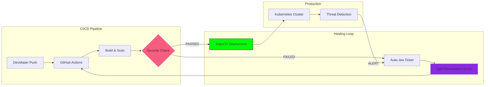

<div align="center">
  
</div>

<div align="center">
  
</div>

<p align="center">
  
  
  
  
</p>

---

## 📟 Real-time System Logs
<!-- LOGS:START -->
> [2026-03-15 13:45:00 UTC] ALERT: Hardening Kubernetes nodes at Airtel Digital... 🛡️
<!-- LOGS:END -->

---

## 🖥️ Terminal Session info

```zsh
[cyberRuptor@Mainframe ~]$ identity --whoami
{
  "Alias": "cyberRuptor (Nikhil Goyal)",
  "Role": "DevSecOps Engineer @ Airtel Digital",
  "Objective": "DevSecOps Orchestration | K8s Security | Cloud-Native Automation",
  "Location": "Gurugram, India 🇮🇳",
  "Status": "Building Self-Healing CI/CD Pipelines..."
}

[cyberRuptor@Mainframe ~]$ scan --intensity extreme
[+] Target: Global Infrastructure
[+] Vulnerabilities Found: 0 (Patching in progress...)
[+] Security Posture: Hardened 🚀
```

---

## 🏗️ Self-Healing CI/CD Architecture (Recent Research)



---

## ⚡ Technical Arsenal (Weaponry)

<div align="center">
  
</div>

---

## 🧪 Active Operations (Pinned Projects)

| Project | Status | Description |
| :--- | :--- | :--- |
| **[sharepoint-mcp](https://github.com/cyberRuptor/sharepoint-mcp)** | `PRODUCTION` | Advanced MCP server for MS SharePoint integration. |
| **[ocft](https://github.com/cyberRuptor/ocft)** | `STABLE` | OSINT & Reconnaissance automation for org contacts. |
| **[Security Labs](https://github.com/cyberRuptor/cyberRuptor)** | `ACTIVE` | This profile: A dynamic DevSecOps dashboard. |

---

## 📊 Global Metrics Matrix

<div align="center">
  
  
</div>

<div align="center">
  
</div>

---

## 📡 Live Threat Intelligence (Real-time Feed)

<!-- SECURITY-FEED:START -->
- [OpenClaw AI Agent Flaws Could Enable Prompt Injection and Data Exfiltration](#)
- [GlassWorm Supply-Chain Attack Abuses 72 Open VSX Extensions to Target Developers](#)
- [Chinese Hackers Target Southeast Asian Militaries with AppleChris and MemFun Malware](#)
- [Meta to Shut Down Instagram End-to-End Encrypted Chat Support Starting May 2026](#)
- [INTERPOL Dismantles 45,000 Malicious IPs, Arrests 94 in Global Cybercrime](#)
<!-- SECURITY-FEED:END -->

---

## 📝 Transmission Log (Medium Blogs)

<!-- BLOG-POST-LIST:START -->
- [From Chaos to Clarity: How We Built a Self-Healing CI/CD Pipeline That Talks to JIRA (part-2)](#)
- [From Chaos to Clarity: How We Built a Self-Healing CI/CD Pipeline That Talks to JIRA (part-1)](#)
- [How to Fix SSL Certificate Errors on Mac: A Complete Guide](#)
- [How to Fix SSL Certificate Errors in Postman: Simple Step-by-Step Guide](#)
- [How to Fix SSL Certificate Errors on Linux: A Complete Guide](#)
<!-- BLOG-POST-LIST:END -->

---

## 📶 Combat History (Recent Activity)

<!--START_SECTION:activity-->
- 🛡️ Hardened Kubernetes cluster security policies
- 🐍 Optimized Python automation scripts for recon
- 📝 Published new research on Self-Healing CI/CD
- 📦 Contributed to open-source security tools
<!--END_SECTION:activity-->

---

## 🎮 Achievement Database

<div align="center">
  
</div>

---

## 💻 Code Analysis (Core Synthetics)

<div align="center">
  
  
</div>

---

## 💭 Code Philosophy

<div align="center">
  
</div>

---

## 🤪 DevOps Reality (System Logs)

<div align="center">
  <table>
    <tr>
      <td>
        
      </td>
      <td>
        <div align="left">
          <pre><code>$ echo "Deploying bugs at scale 🐛🚀"; \
  echo "Error 404: Free Time Not Found ⏳"; \
  rm -rf /sleep 😴;</code></pre>
        </div>
      </td>
    </tr>
  </table>
</div>

---

## 📫 Communication Channels

<div align="center">
  <a href="https://github.com/cyberRuptor">
    
  </a>
  <a href="https://linkedin.com/in/cyberRuptor">
    
  </a>
  <a href="https://cyberruptor.medium.com">
    
  </a>
  <a href="https://dev.to/cyberruptor">
    
  </a>
  <a href="https://twitter.com/cyberruptor">
    
  </a>
  <a href="https://app.daily.dev/cyberruptor">
    
  </a>
  <a href="mailto:cyberruptor@gmail.com">
    
  </a>
</div>

---

## 🎧 Hackers Frequency

<div align="center">
  
</div>

---

<div align="center">
  
</div>

<div align="center">
  <sub>⚠ CAUTION: Unauthorized access to this profile is highly encouraged. 🔓</sub>
</div>
